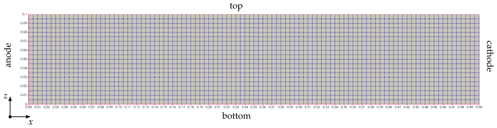

# Experiment 0: Poisson-Nerst-Plank
* [Intro](#int)
* [Domain and Physical Problem](#a0)
    1. [ch1](#a1)
    2. [ch2](#a2)
    3. [image](#ciao)
* [Equations and Boundary Conditions](#b0)
    1. [ch1](#b1)
    2. [ch2](#b2)
* [Numerical Methods](#c0)
    1. [ch1](#c1)
    2. [ch2](#c2)
* [Running Instructions](#d0)
    1. [ch1](#d1)
    2. [ch2](#d2)

<h2 id="a0">Domain and Physical Problem</h2>

<h2 id="b0">Equations and Boundary Conditions</h2>

<h2 id="c0">Numerical Methods</h2>

